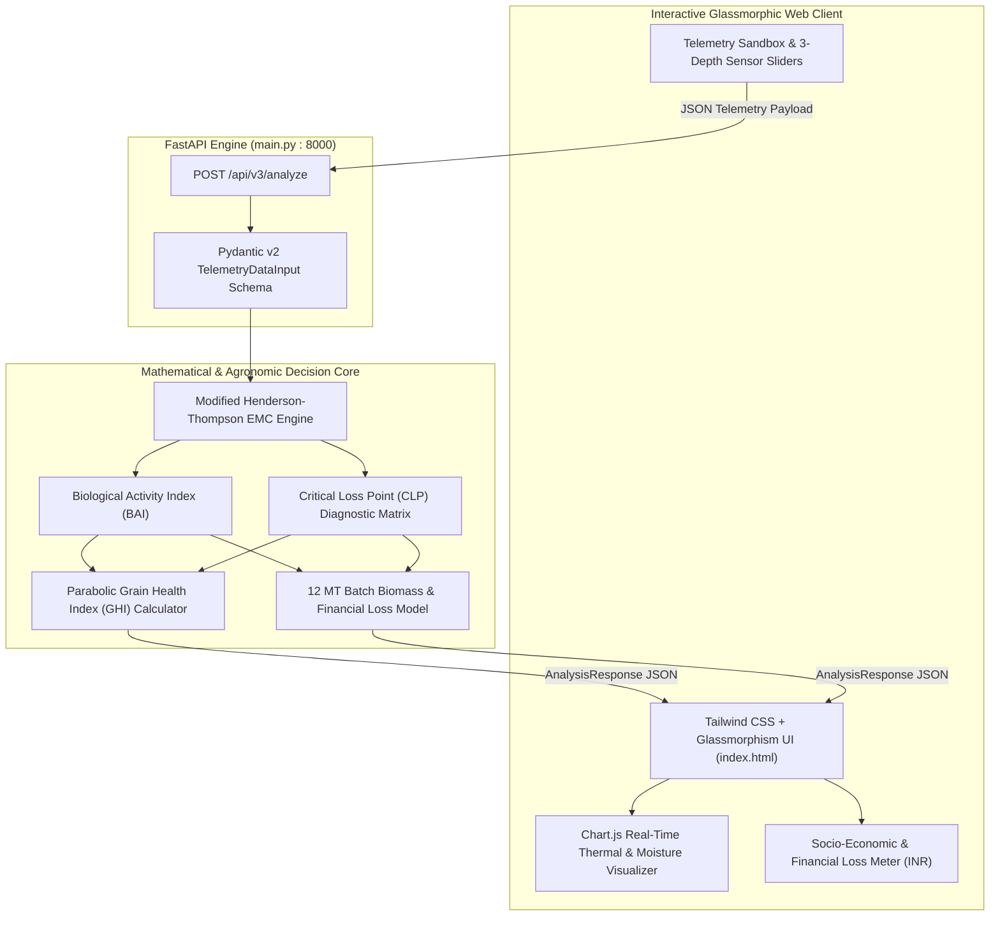

<div align="center">

# 🌾 GrainGuardian Web — Intelligent Multi-Crop Decision Support & Post-Harvest Security Platform

**IEEE-Compliant Multi-Crop Decision Support Systems Engine with Real-Time Critical Loss Point (CLP) Diagnostics & Enterprise Control Center**

[](https://github.com/nleelaranga-ai/grain_guardian_v1-WEB)
[](https://fastapi.tiangolo.com)
[](https://www.python.org)
[](https://tailwindcss.com)
[](https://www.chartjs.org)
[](https://docs.pydantic.dev)
[](LICENSE)

</div>

---

## 📑 Executive Summary

Post-harvest storage losses claim **over 15–20% of total harvested grain yields** across South Asia and developing economies, translating to billions of dollars in lost agricultural GDP. Traditional storage monitoring depends on intermittent physical sampling or lagging surface measurements, failing to detect internal moisture migration and thermal hot spots until irreversible mold germination (*Aspergillus flavus*) or insect outbreaks have already occurred.

**GrainGuardian Web** is an enterprise-grade, IEEE-compliant agronomic intelligence platform designed for **Custom Hiring Centers (CHCs), Paddy Millers, PACS, Warehousing Corporations, and Agritech Operators**:
1. **Modified Henderson-Thompson Thermodynamic Modeling**: Accurately computes Equilibrium Moisture Content ($\text{EMC} \%$) across multiple staple crops (Paddy Rice, Wheat, Maize) from 3-depth temperature stratification and relative humidity.
2. **Biological Activity Index (BAI)**: Predicts fungal spore colonization and metabolic insect respiration before visible mold emergence.
3. **Critical Loss Point (CLP) Matrix**: Performs real-time multi-dimensional violation auditing across moisture, thermal spikes, ambient relative humidity, and fungal infestation thresholds.
4. **Parabolic Grain Health Index (GHI Engine)**: Scores aggregate storage vitality from $0$ to $100$ with weighted non-linear penalty curves.
5. **Socio-Economic & Financial Loss Modeling**: Translates physical moisture degradation and biomass loss into real-time financial loss estimates (in ₹ INR) based on MSP and market valuations across 12 MT standard silo batches.
6. **Responsive Glassmorphism Control Center**: Interactive single-page dashboard featuring real-time telemetry simulation, Chart.js thermal gradients, and automated actionable farmer advisories.

---

## 🎯 Problem Statement

* **Lagging Sensory Heuristics**: Physical grain testing (biting, palm inspection) cannot observe core temperature spikes and invisible moisture pockets deep within 12,000 kg silos.
* **Aflatoxin & Microbial Spoilage**: Moisture $>14\%$ combined with temperatures $>32^\circ\text{C}$ creates an ideal microclimate for carcinogenic aflatoxins within 48–72 hours.
* **Thermal Convection Breakage**: Inadequate aeration produces internal thermal gradients $>4^\circ\text{C}$, causing moisture migration and resulting in 25–30% grain shattering during commercial milling.
* **Financial Risk Blindness**: Warehouse managers lack automated tools to quantify the exact monetary loss incurred by each hour of delayed aeration or drying.

---

## 🏛️ System Architecture



---

## 🧮 Mathematical & Scientific Formulation

The GrainGuardian engine eliminates empirical guesswork by employing verified agricultural engineering thermodynamics:

### 1. Equilibrium Moisture Content ($\text{EMC} \%$) — Modified Henderson-Thompson Equation

For a given relative humidity $\text{RH} \in [0.1, 0.999]$ and core grain temperature $T_3$ ($^\circ\text{C}$):

$$\text{EMC} = \left( \frac{-\ln(1 - \text{RH})}{c_1 \cdot (T_3 + c_2)} \right)^{\frac{1}{c_3}} \times 100$$

Where $c_1, c_2, c_3$ are crop-specific constants calibrated to ASAE/IEEE standards:

| Crop Identifier | Crop Name | $c_1$ | $c_2$ | $c_3$ | Safe Limit ($\%$) | Warn Limit ($\%$) | Critical Limit ($\%$) |
| :---: | :--- | :---: | :---: | :---: | :---: | :---: | :---: |
| `0` | **Paddy (Rice)** | $1.9187 \times 10^{-5}$ | $51.161$ | $2.4484$ | $13.5\%$ | $14.5\%$ | $16.0\%$ |
| `1` | **Wheat** | $2.3007 \times 10^{-5}$ | $35.853$ | $2.2857$ | $13.0\%$ | $14.0\%$ | $15.5\%$ |
| `2` | **Maize (Corn)** | $8.6541 \times 10^{-5}$ | $49.810$ | $1.8634$ | $13.5\%$ | $14.2\%$ | $15.8\%$ |

---

### 2. Biological Activity Index ($\text{BAI}$) & Fungal Risk

Predicts the biological respiration rate of fungal spores (*Aspergillus*, *Penicillium*) within the interstitial air space:

$$\text{BAI} = \left( \frac{\text{EMC}}{\text{SafeLimit}} \right)^2 \times \left( \frac{T_3}{28.0^\circ\text{C}} \right)$$

* **$\text{BAI} < 1.05$**: `LOW` Risk — Nominal hermetic preservation state.
* **$1.05 \le \text{BAI} < 1.30$**: `MEDIUM` Risk — Elevated metabolic activity; initiate ventilation.
* **$\text{BAI} \ge 1.30$**: `HIGH` Risk — Active spore germination; extract core depth verification samples immediately.

---

### 3. Critical Loss Point ($\text{CLP}$) Diagnostic Matrix

The engine audits 5 simultaneous operational failure gates:
* **$\text{CLP}_M$ (Moisture Violation)**: $\text{EMC} > \text{CritMoisture}$
* **$\text{CLP}_T$ (Thermal Violation)**: $\max(T_1, T_2, T_3) > \text{CritTemp}$ (e.g., $>42^\circ\text{C}$ for Paddy)
* **$\text{CLP}_H$ (Ambient Humidity Violation)**: $\text{RH} > 75.0\%$
* **$\text{CLP}_D$ (Duration Violation)**: Time under elevated temperature $>48$ hours
* **$\text{CLP}_F$ (Fungal Outbreak)**: $\text{BAI} \ge 1.30$

---

### 4. Parabolic Grain Health Index ($\text{GHI}$) Scoring

Computes aggregate vitality from $0$ (Catastrophic Spoilage) to $100$ (Pristine):

$$\text{Penalty}_{\text{total}} = 0.50 \cdot P_m + 0.30 \cdot P_t + 0.20 \cdot P_{\text{gradient}}$$

Where:
* **Moisture Penalty ($P_m$)**:
  $$P_m = \max\left(0, \; \frac{\text{EMC} - \text{WarnMoisture}}{\text{CritMoisture} - \text{WarnMoisture}} \times 100\right)$$
* **Thermal Penalty ($P_t$)**:
  $$P_t = \max\left(0, \; \frac{T_{\max} - \text{WarnTemp}}{\text{CritTemp} - \text{WarnTemp}} \times 100\right)$$
* **Thermal Gradient Penalty ($P_{\text{gradient}}$)**:
  $$\Delta T = \max\left(|T_1 - T_2|, \; |T_2 - T_3|, \; |T_1 - T_3|\right)$$
  $$P_{\text{gradient}} = 25.0 \quad \text{if } \Delta T > 4.0^\circ\text{C}, \quad \text{else } 0.0$$

$$\text{GHI} = \max\left(0, \; \min\left(100, \; \text{round}\left(100.0 - \text{Penalty}_{\text{total}}\right)\right)\right)$$

---

### 5. Socio-Economic Degradation & Financial Loss (INR)

For a standardized commercial storage silo batch of $M_{\text{stored}} = 12,000 \text{ kg}$ (12 Metric Tons):

$$\Delta W = \begin{cases} M_{\text{stored}} \times \left(\frac{\text{EMC} - \text{SafeLimit}}{100}\right) \times S_f & \text{if } \text{EMC} > \text{SafeLimit} \\ 0.0 & \text{otherwise} \end{cases}$$

Where $S_f = 1.35$ if $\text{CLP}_F$ is active (fungal mass loss multiplier), else $1.0$.

$$\text{Estimated Financial Loss (₹ INR)} = \text{round}\left(\frac{\Delta W}{1000} \times \text{PricePerTon}, \; 2\right)$$

* **Paddy Price**: ₹21,840 / Ton
* **Wheat Price**: ₹22,750 / Ton
* **Maize Price**: ₹20,900 / Ton

---

## 📂 Project Repository Structure

```
grain_guardian_v1-WEB/
├── .github/workflows/ci.yml       # Automated CI test workflow
├── main.py                        # FastAPI Decision Support Engine v3.0.0
├── index.html                     # Glassmorphic Web Control Center & Simulator
├── requirements.txt               # Backend dependencies (FastAPI, Uvicorn, Pydantic)
└── README.md                      # Comprehensive production documentation
```

---

## ⚡ Quickstart & Installation

### 1. Clone & Setup Environment

```bash
# Clone repository
git clone https://github.com/nleelaranga-ai/grain_guardian_v1-WEB.git
cd grain_guardian_v1-WEB

# Create and activate virtual environment
python -m venv venv
# On Windows:
venv\Scripts\activate
# On Linux/macOS:
source venv/bin/activate

# Install dependencies
pip install -r requirements.txt
```

### 2. Launch the FastAPI Intelligence Engine

```bash
uvicorn main:app --host 0.0.0.0 --port 8000 --reload
```

* **Interactive OpenAPI Swagger Docs**: `http://localhost:8000/docs`
* **Alternative ReDoc Docs**: `http://localhost:8000/redoc`

### 3. Open the Web Control Center

Simply open `index.html` in any modern browser (Chrome, Edge, Firefox, Safari) or serve it locally:

```bash
# Optional Python static server
python -m http.server 3000
```
Navigate to `http://localhost:3000` to interact with the full dashboard and live telemetry simulator.

---

## 🔌 API Reference & Usage

### Execute Grain Intelligence Pass
* **Endpoint**: `POST /api/v3/analyze`
* **Content-Type**: `application/json`

#### Request Payload Schema:
```json
{
  "crop_id": 0,
  "temp_t1": 28.5,
  "temp_t2": 33.2,
  "temp_t3": 36.8,
  "rh": 78.4,
  "is_storage": true
}
```

#### Field Descriptions:
* `crop_id` (*int*): `0` for Paddy (Rice), `1` for Wheat, `2` for Maize.
* `temp_t1` (*float*): Surface / Top Layer Temperature ($^\circ\text{C}$). Range: $0.0 - 75.0$.
* `temp_t2` (*float*): Core / Middle Layer Temperature ($^\circ\text{C}$). Range: $0.0 - 75.0$.
* `temp_t3` (*float*): Bottom / Deep Layer Temperature ($^\circ\text{C}$). Range: $0.0 - 75.0$.
* `rh` (*float*): Relative Humidity ($\%$). Range: $10.0 - 100.0$.
* `is_storage` (*bool*): `true` for bagged storage / silo piles; `false` for drying yard.

#### Sample `curl` Command:
```bash
curl -X POST "http://localhost:8000/api/v3/analyze" \
  -H "Content-Type: application/json" \
  -d '{
    "crop_id": 0,
    "temp_t1": 29.0,
    "temp_t2": 34.5,
    "temp_t3": 37.2,
    "rh": 79.0,
    "is_storage": true
  }'
```

#### Sample Response Payload (`201 Created`):
```json
{
  "record_id": "rec-1726727400",
  "grain_health_index": 72,
  "fungal_risk_status": "HIGH",
  "biological_activity_index": 1.48,
  "projected_weight_loss_kg": 284.6,
  "estimated_financial_loss_inr": 6215.66,
  "thermal_average": 33.6,
  "clp_matrix": {
    "clp_moisture_violation": true,
    "clp_temp_violation": false,
    "clp_humidity_violation": true,
    "clp_duration_violation": false,
    "clp_fungal_violation": true
  },
  "action_advisory": [
    "CRITICAL_MOISTURE: Calculated Moisture (15.2%) breaches safety envelope limits. Engage mechanical extraction air systems.",
    "THERMAL_SPIKE: Latent heat layer found (Max: 37.2°C). Rotate bulk storage silo volume.",
    "FUNGAL_OUTBREAK_RISK: High Biological Index Activity detected. Extract core depth layer verification probe samples."
  ],
  "processing_time_ms": 1.248,
  "generated_at": "2026-09-19T06:30:00Z",
  "prediction_confidence": 90.8
}
```

---

## 🖥️ Web Control Center Features

* **3-Depth Real-Time Telemetry Simulator**: Interactive sliders for Top, Middle, and Bottom layer temperatures, alongside relative humidity and crop selection.
* **Live Thermodynamic Charts**: Visualizes Equilibrium Moisture curves and thermal stratification across the 3 physical layers using Chart.js.
* **Instant Socio-Economic Loss Card**: Displays real-time estimated financial loss in ₹ INR and projected weight loss in kg for 12 MT batches.
* **Automated Action Advisories**: Generates prioritized mitigation steps (mechanical aeration, silo rotation, core sampling) based on CLP violations.
* **Modern Glassmorphic Aesthetic**: Designed with Tailwind CSS, Plus Jakarta Sans, JetBrains Mono, and glowing status pills compatible with dark/light themes.

---

## 🗺️ Engineering Roadmap

- [x] **v3.0.0**: Modified Henderson-Thompson EMC engine, CLP diagnostic matrix, and FastAPI backend.
- [x] **v3.1.0**: Glassmorphic web dashboard with real-time Chart.js telemetry visualization.
- [ ] **v3.2.0 (Q3 2026)**: Webhook alert integrations for WhatsApp Business API and SMS gateway notifications for rural farmers.
- [ ] **v3.3.0 (Q4 2026)**: Historical batch analytics with SQLite/PostgreSQL persistence and CSV/PDF report export.
- [ ] **v4.0.0 (2027)**: Direct BLE Web Bluetooth API connectivity to physical ESP32 probe hardware directly from the browser.

---

## 📜 License & Author

Distributed under the **MIT License**.

**Lead Systems Architect & Developer**:  
**LEELA RANGA PRASAD** (`nleelaranga-ai`)  
*AI & Data Science Undergraduate, VR Siddhartha Engineering College*  
[LinkedIn](https://linkedin.com/in/leela-ranga-prasad-ba4936214) • [GitHub](https://github.com/nleelaranga-ai) • [Email](mailto:n.leelaranga@gmail.com)